# Open WebUI Admin Panel Guide

Welcome to the Admin Panel! This guide will walk you through the essential tools you need to create experiment workflows, manage user groups, and analyze participant sessions.

## 1. Admin Panel Tour & Navigation

The Admin Panel is your central hub for managing studies and participants. 

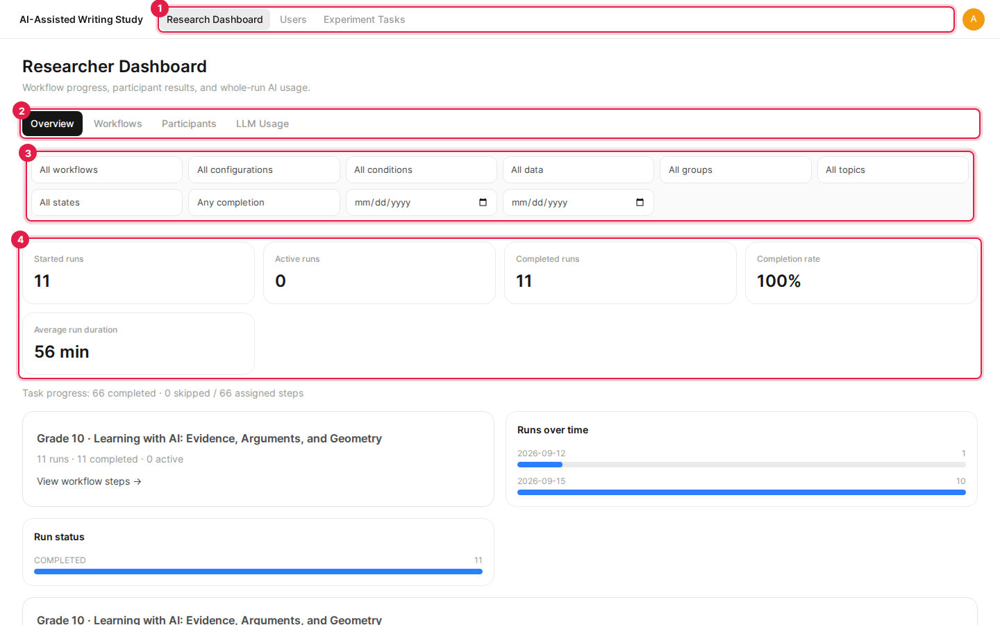

At the top of the page, you'll find the primary navigation bar:
- **Research Dashboard**: View study progress, participant activity, and overall results. You can switch between different tabs like Overview, Workflows, Participants, and LLM Usage to get specific insights. You can also filter these views by User Group or Experiment State.
- **Users**: Manage participant accounts and create User Groups to organize them.
- **Experiment Tasks**: Create the individual tasks (essays, questions, surveys) and assemble them into full experiment workflows.

---

## 2. Researcher Dashboard & Participant Sessions

The Researcher Dashboard organizes results by the workflow configuration participants received. Workflows show ordered steps with progress, elapsed time, question grades, essay texts and length statistics, or survey answers. The latest deployed configuration with runs opens by default; older configurations remain selectable even after library edits or deletion. Unmatched deployments appear as historical workflows.

All data is included by default. Synthetic runs carry a **Synthetic demo** label and can be filtered separately. LLM Usage counts the whole run and separates messages without a step assignment. Historical runs without an applied plan may use explicitly labeled time-window attribution.

### Exporting Sessions
Navigate to **Research Dashboard** &rarr; **Participants** to see a list of everyone assigned to your studies.

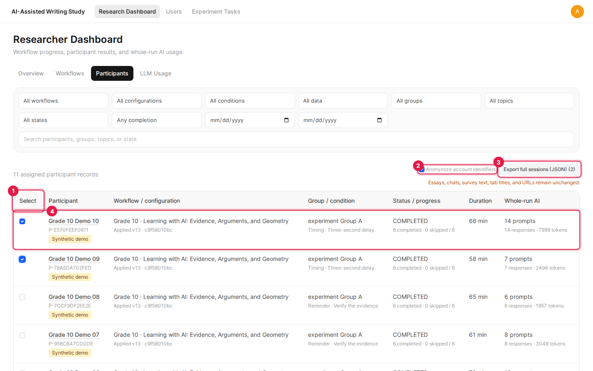

- Select the participants whose completed or active sessions you want to export.
- If you need to protect participant privacy, toggle the **Anonymize account identifiers** option to hide emails and usernames.
- Click **Export full sessions (JSON)** to download the data for the selected participants.

### Session Inspector
Click a participant's name to open the Session Inspector within the current workflow context.

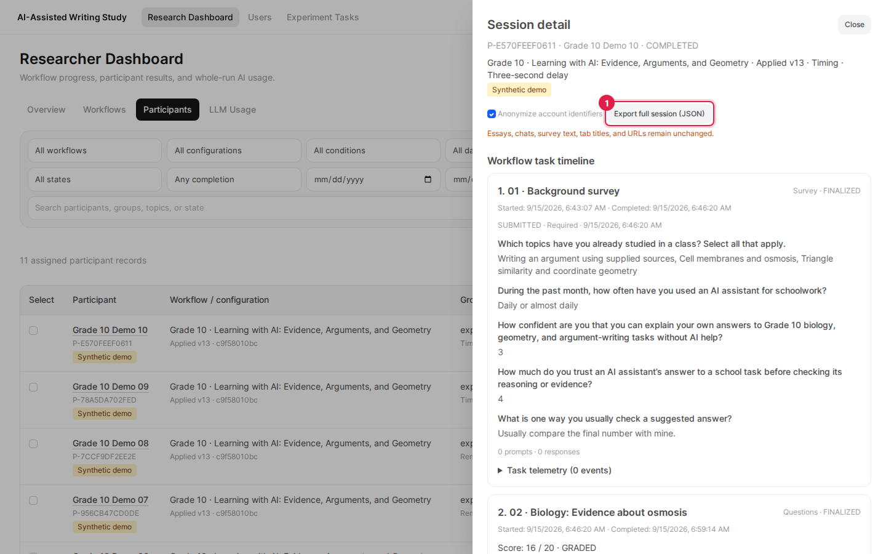

The ordered task timeline contains essays, question submissions and grading actions, survey responses, task conversations, and telemetry. Pending grades stay pending; optional skipped surveys remain distinct from completed ones. Whole-run elapsed duration is separate from interaction telemetry. Full exports include workflow/configuration identity and retain existing fields. Account anonymization does not redact free text or sensitive tab URLs.

---

## 3. User Groups

User Groups allow you to organize participants into different study conditions or cohorts (e.g., a Control Group and a Test Group).

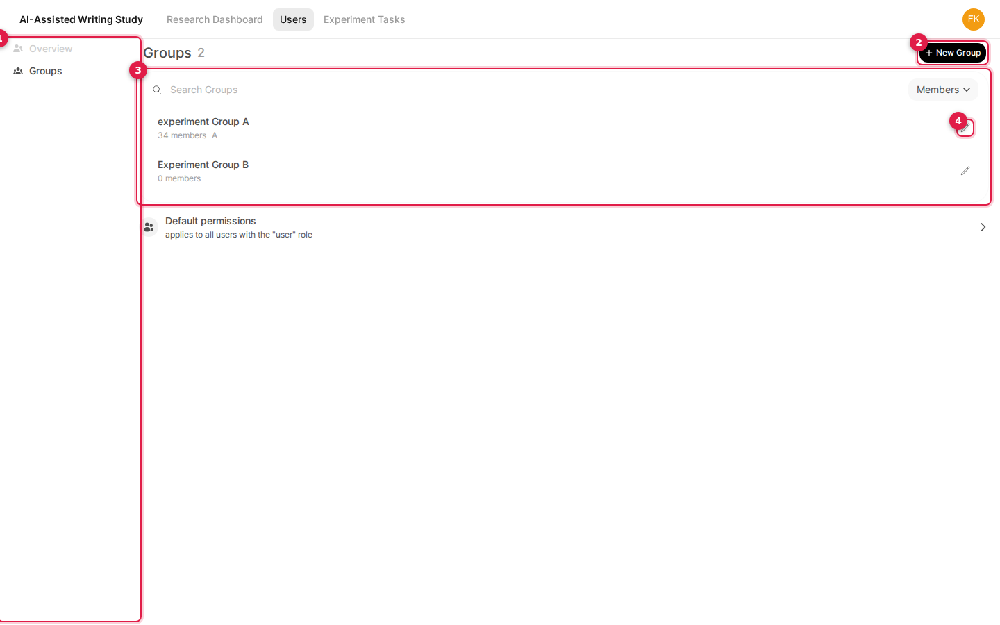

Navigate to **Users** &rarr; **Groups** to view all your existing groups. 

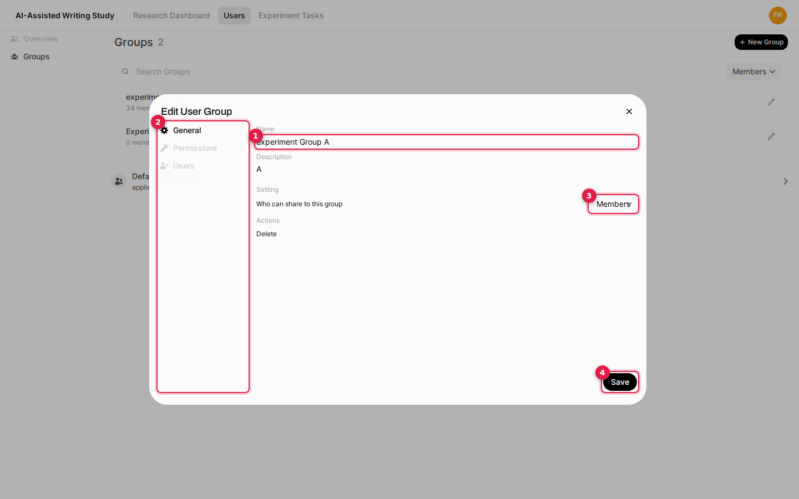

To create a new group, click **+ New Group**. Give the group a clear name and description. You can also adjust specific permissions for the group and assign users to it directly from this menu.

---

## 4. Creating Experiment Tasks

Before you can build a complete study workflow, you need to create the individual tasks. Navigate to **Experiment Tasks** to get started.

### Essay Tasks
Essay tasks define the writing prompts and instructions for your participants.

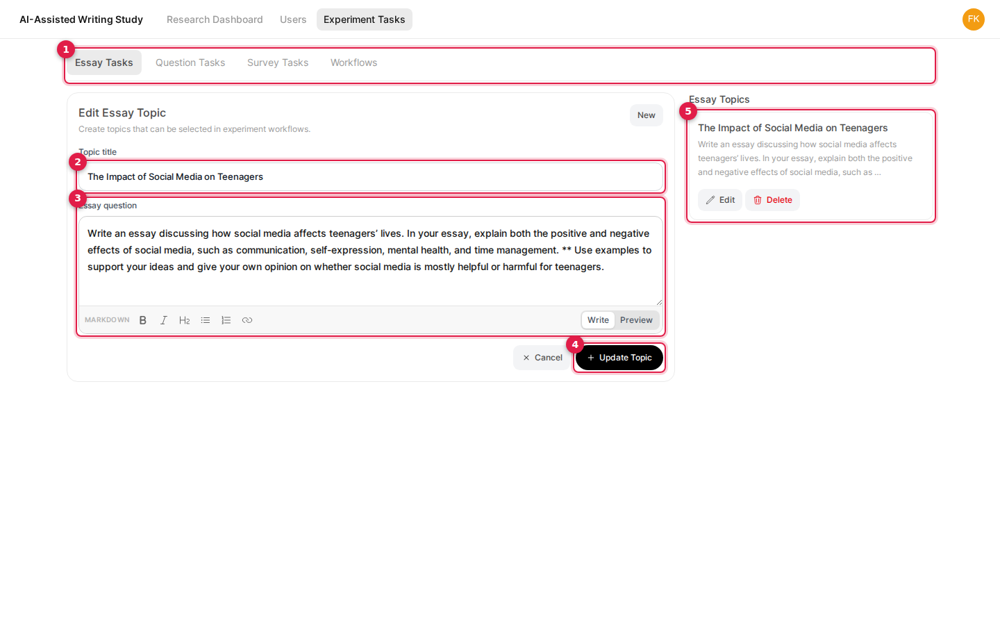

Give your topic a title and use the text editor to write out the prompt, background context, and guidelines. You can use the **Preview** tab to see how it will look to participants before saving.

### Question Tasks
Question tasks let you create comprehension or knowledge tests.

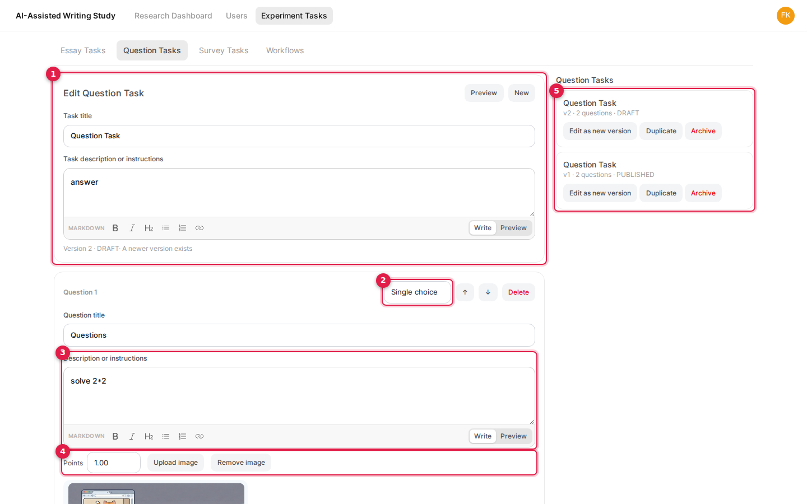

You can choose from several formats, including Single Choice, Multiple Select, Fill in the Blank, or Free Text. You can also assign point values and attach images to your questions.

### Survey Tasks
Survey tasks are used for pre-study or post-study questionnaires.

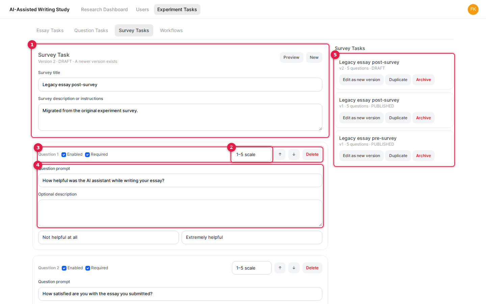

You can create 1–5 scale questions, multiple-choice questions, or text inputs. You can customize the labels for the scales and choose whether a question is required.

---

## 5. Creating Experiment Workflows

Workflows combine your individual tasks into a step-by-step study pipeline.

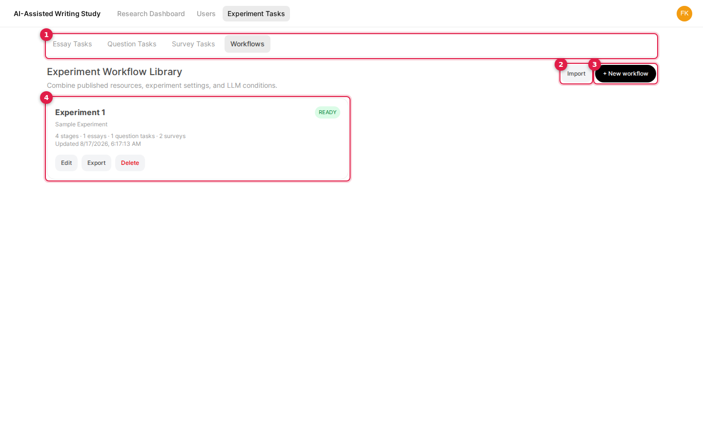

Navigate to **Experiment Tasks** &rarr; **Workflows**. Here you will see your Workflow Library, which lists all your existing workflows. Click **+ New Workflow** to create a new one.

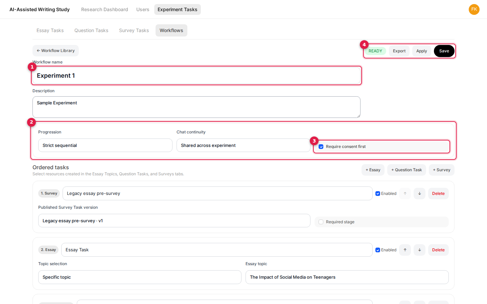

In the Workflow Editor, give your study a name and description. You can set the rules for how participants progress through the study, such as whether they must go in order (Strict sequential) or can jump around (Free navigation). You can also choose if participants must agree to a consent form first.

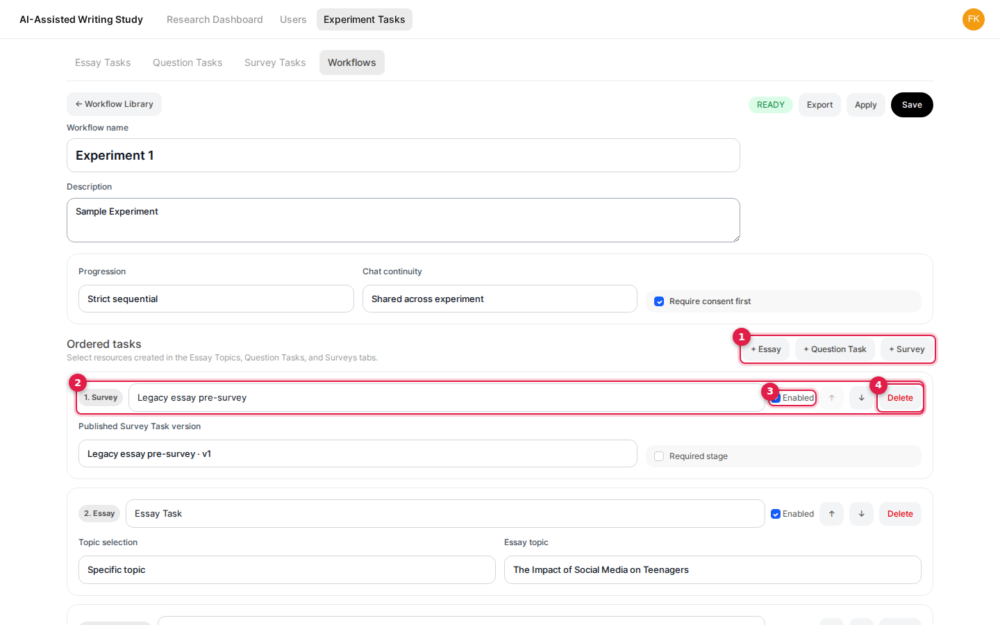

Scroll down to the **Ordered tasks** section to add stages to your workflow. Click **+ Essay**, **+ Question Task**, or **+ Survey** to add the tasks you created earlier. You can use the up and down arrows to easily reorder them.

---

### Student LLM prompt limits

Each essay or question task in a workflow has an **LLM prompt limit**, initially **100**. Essays use one limit for the whole task. For question tasks, choose **Whole task** or **Each question separately** and enter a limit for each question. Set **0** to disable student LLM requests for that task or question.

Students see prompts used, remaining allowance, and requests in progress beside their task and chat input. Only successfully completed responses count, including regenerations and continuations. Failed or cancelled requests restore the allowance. Switching tasks, questions, or chats does not reset usage; students can keep editing and submitting answers after reaching the limit.

Existing workflow tasks are migrated to a limit of 100. Workflow exports use version 4 and preserve per-question limits when imported or applied to a group. Supported version 2 and version 3 archives are upgraded automatically with a task-wide limit of 100.

### Whole-group conditions and combined behaviors

In **LLM behavior and response perturbations**, allocations are whole percentages from **0% to 100%**. Enabled conditions must total **100%** and include exactly one control. The control may have **0%** allocation; conditions at 0% and disabled conditions are never assigned to new participants.

To give every new participant in a group reliability warnings and delayed responses together:

1. Set **Control** to **0%** and leave it enabled.
2. Add a condition named **Warning + delay**, leave it enabled, and set its allocation to **100%**. Set any other enabled conditions to 0%.
3. Within that condition, enable **Reliability-warning modal** and configure its message, acknowledgement, and cadence. For a warning after every prompt, choose **Every N prompts** with a value of **1**.
4. Set **Response timing** to **Delayed reveal** and choose the delay in seconds. The delay applies to every response, independently of the warning cadence.
5. Save the workflow and publish it to the target group. The same settings are available in the direct experiment-plan editor.

Behaviors within a condition operate together. Separate groups can each use a different condition at 100%, making group membership determine the condition for new sessions. Participants whose sessions already exist keep their original plan and condition when a new version is published.

## 6. Downloading and Uploading Workflows

Workflows can be easily saved to your computer or shared with others.

- **Downloading (Exporting)**: From the Workflow Library or the Workflow Editor, click the **Export** button. This will download a `.zip` file containing your workflow and all of its associated tasks.
- **Uploading (Importing)**: In the Workflow Library, click the **Import** button and upload a `.zip` file to instantly restore a workflow and all of its tasks.

---

## 7. Applying Workflows to User Groups

Once your workflow is ready, you need to apply it to a User Group so participants can access it.

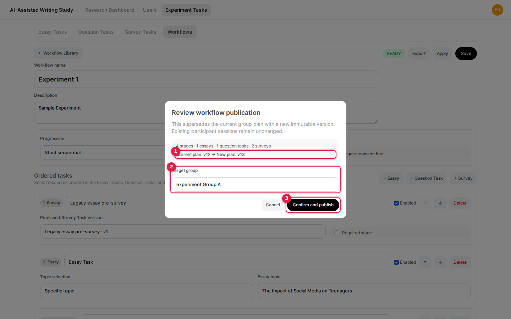

In the Workflow Editor, click the **Apply** button at the top right. A menu will appear where you can select the target User Group. Once you click **Confirm and publish**, the workflow will be active for all participants in that group.
