# LLMScribe Admin Panel Guide

Welcome to the **LLMScribe** Admin Panel (built on Open WebUI)! This guide provides researchers and study administrators with a complete walkthrough of essential tools: managing participants and cohorts, authoring modular experiment tasks, configuring prompt allowances and behavioral perturbations, assembling end-to-end experiment workflows, and analyzing rich session telemetry.

---

## 1. Admin Panel Tour & Navigation

The Admin Panel serves as your central command center for deploying studies, monitoring real-time participant activity, and inspecting research data.

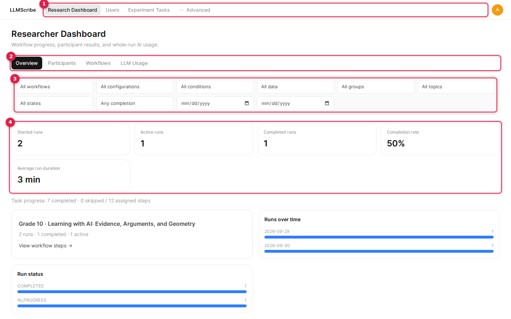

### Primary Navigation Bar
Across the top header, the main navigation links provide access to all core sections:
- **Research Dashboard**: The primary interface for tracking overall study progress, participant milestones, session timelines, and LLM telemetry.
- **Users**: Manage participant accounts, generate user credentials in bulk, export user rosters to CSV, and organize participants into User Groups.
- **Experiment Tasks**: Author and maintain modular study components (Essays, Questions, and Surveys) and assemble them into full Experiment Workflows.
- **Advanced**: Access administrative system controls, platform configurations, model connection endpoints, and API settings.

### Dashboard Sub-Navigation Tabs
Under the **Research Dashboard**, switch between specialized monitoring views:
- **Overview**: High-level key performance indicator (KPI) cards displaying enrolled participant counts, active vs. completed sessions, average study duration, and aggregate LLM interactions.
- **Participants**: A detailed roster of participants showing live session progression, clean formatted start and completion timestamps, and export actions.
- **Workflows**: Visual breakdown of deployed workflows, stage configurations, and active participant cohorts.
- **LLM Usage**: Aggregate and granular tracking of student model queries, token usage, latency, and prompt distribution across tasks.

### Study Filter Controls
Refine any dashboard view using the global filter bar:
- **Workflow / Version**: Focus telemetry on a specific experiment workflow or published configuration version.
- **User Group**: Isolate data for specific participant cohorts (e.g., Control Group vs. Test Group).
- **Experiment State**: Filter by session progress—view all participants, only active sessions, or completed runs.

---

## 2. Researcher Dashboard & Participant Sessions

The Researcher Dashboard organizes data around the exact workflow version received by participants. Workflows display ordered task steps alongside completion progress, elapsed time, automated question scores, essay submissions, and survey responses.

The most recently deployed workflow configuration with active runs opens by default; older configuration snapshots remain fully selectable even after workflow modifications or deletions. Historical runs without an assigned plan retain time-window attribution. Synthetic runs carry a visible **Synthetic demo** badge and can be filtered separately.

### Exporting Sessions
Navigate to **Research Dashboard** &rarr; **Participants** to view all participants assigned to your studies.

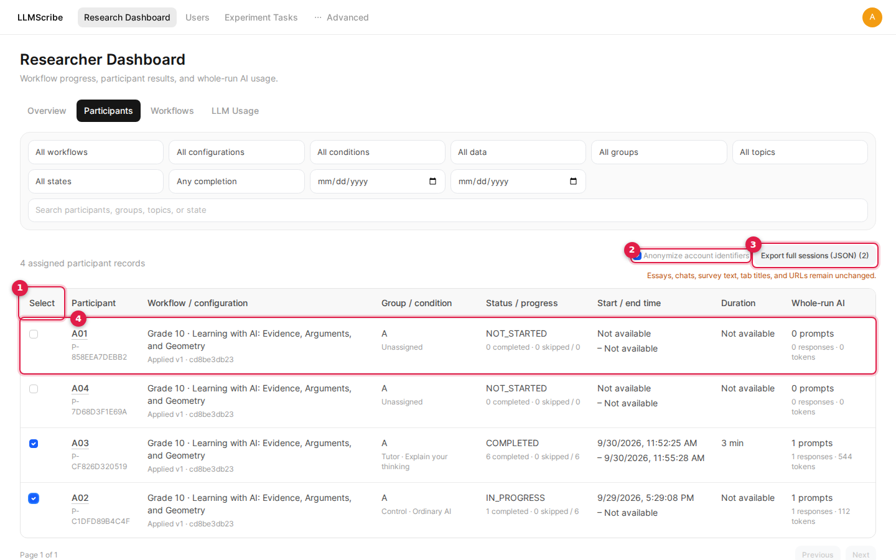

- **Participant Roster**: Displays participant identifiers, usernames, emails, assigned groups, experiment states (`Active`, `Completed`), visual progress bars, **Started At** and **Completed At** formatted timestamps, and total time spent.
- **Selection**: Select individual participant checkboxes or click the header checkbox to batch-select participants for export.
- **Anonymize Account Identifiers**: Check this toggle before exporting to automatically redact participant emails and usernames, ensuring privacy compliance for IRB and open-science data sharing.
- **Export Full Sessions (JSON)**: Click this button to download complete longitudinal session packages containing prompt histories, model generations, perturbation events, stage transitions, and interaction telemetry.

### Session Inspector
Click any participant's name in the roster to open the slide-over **Session Inspector** drawer.

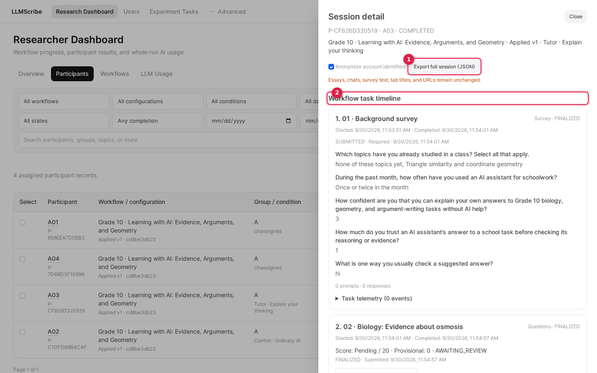

- **Ordered Task Timeline**: Displays the participant's step-by-step progression through each essay, question set, and survey in the workflow.
- **Response Review & Grading**: Inspect submitted essay drafts with word-count statistics, view automated scoring for objective questions, grade free-text answers manually, and evaluate survey responses.
- **Telemetry & Transcripts**: Access full chat logs, AI prompt exchanges, perturbation warnings shown, and millisecond-accurate event timestamps.
- **Individual Session Export**: Export the focused participant's complete data record directly from the inspector header.

---

## 3. User Management & User Groups

LLMScribe provides comprehensive participant onboarding tools, ranging from single account provisioning and bulk credential generation to flexible cohort organization.

### User Management Overview
Navigate to **Users** &rarr; **Overview** (`/admin/users/overview`) to view the complete participant roster.

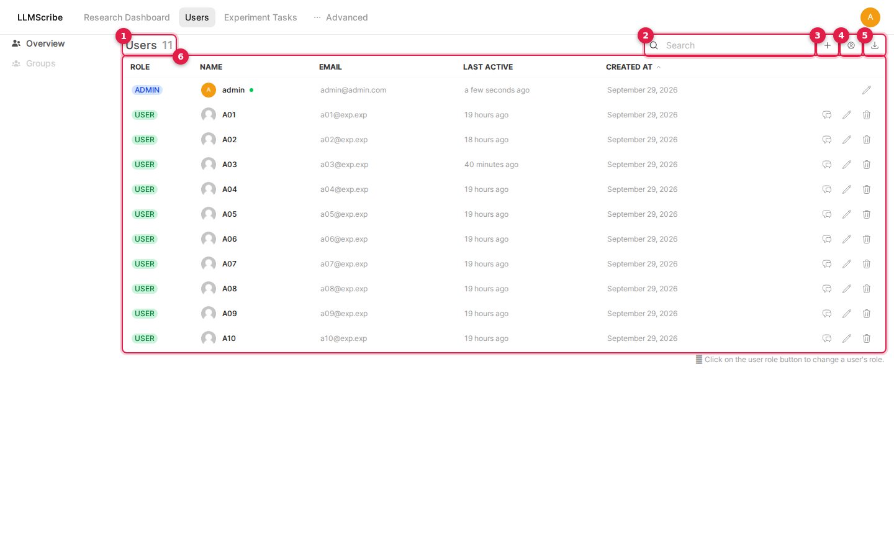

- **User Search**: Quickly locate participant accounts by typing a name or email address into the search field.
- **Role & Status Badges**: View account permissions (`user` vs. `admin`) and active account statuses at a glance.
- **Action Toolbar**:
  - **Add User (`+`)**: Create a single participant account manually by specifying a name, email address, initial password, and role.
  - **Generate Users**: Open the bulk generator modal to create dozens or hundreds of numbered participant accounts in seconds.
  - **Export Users**: Export the current participant roster as a CSV spreadsheet for attendance tracking or cohort auditing.
  - **Row Action Controls**: Edit user profiles, reassign user groups, reset passwords, or delete accounts.

### Bulk User Generation
Click the **Generate Users** button to open the bulk account generator modal. This is especially useful for classroom experiments, lab studies, and proctored evaluations where pre-seeded accounts are needed.

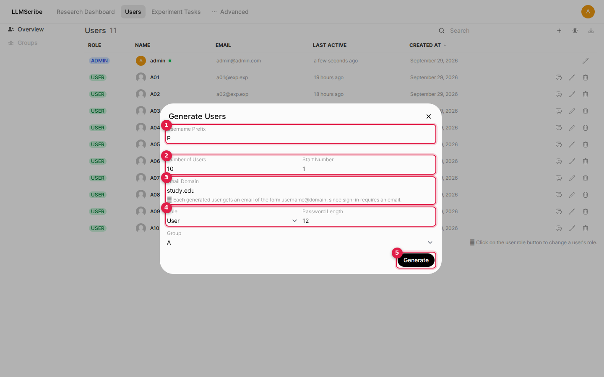

Configure the generation parameters:
- **Username Prefix**: The base identifier for accounts (e.g., `participant_` creates `participant_1`, `participant_2`, etc.).
- **Number of Users**: Total quantity of accounts to generate in this batch (e.g., `25`).
- **Start Number**: Starting integer index (e.g., set to `1` for a new cohort, or `26` to append to an existing pool).
- **Email Domain**: Domain appended to generated usernames (e.g., `study.local` yields `participant_1@study.local`).
- **Role**: Permission level assigned to generated accounts (defaults to `user`).
- **Password Length**: Number of characters for secure randomly generated initial passwords (e.g., `12`).
- **Group**: Target User Group to which all generated accounts are automatically assigned upon creation.

> [!TIP]
> Immediately upon clicking **Generate**, LLMScribe generates the accounts and automatically triggers a download of a CSV file containing usernames, emails, initial passwords, and assigned groups. Securely distribute these credentials to your participants prior to the study session.

### User Groups Management
Navigate to **Users** &rarr; **Groups** (`/admin/users/groups`) to organize participants into study conditions or experimental cohorts (e.g., `Cohort Alpha - Control`, `Cohort Beta - Scaffolding`).

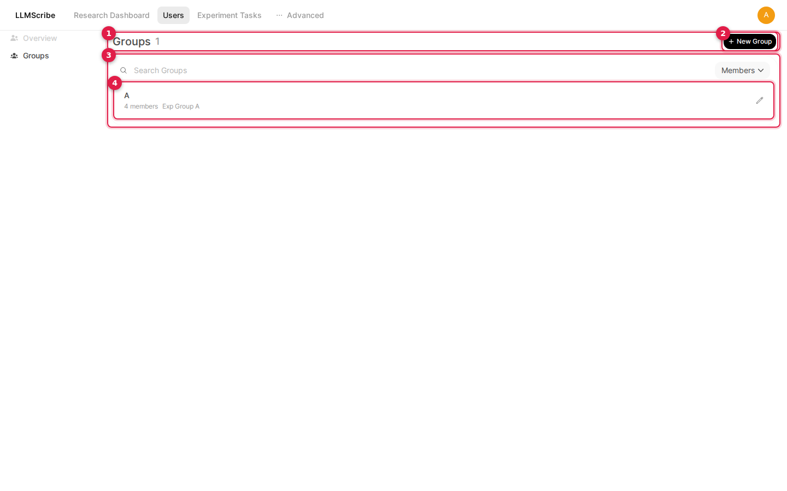

- Review all active cohorts, enrolled participant counts, and creation dates.
- Click **+ New Group** to establish a new cohort.
- Click the edit icon on any existing group to modify its configuration.

### Configuring User Groups
The **Edit Group** modal features a streamlined, two-tab layout designed for straightforward cohort administration:

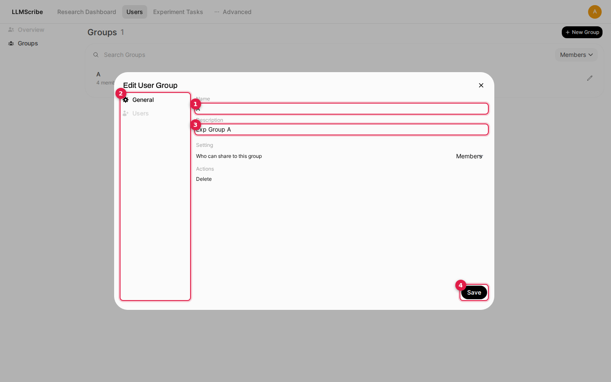

- **General Tab**: Update the group's display Name and Description.
- **Users Tab**: Search for existing users and add them to the group, or remove current members.

> [!NOTE]
> **Streamlined Group Management**: In current versions of the platform, the legacy *Permissions* tab has been removed from the user group modal. Participant capabilities are governed globally by account roles (`user` vs. `admin`), while task and study access is determined by the specific Experiment Workflow applied to the group.

---

## 4. Creating Experiment Tasks

Before building a study pipeline, author the individual modular tasks under **Experiment Tasks**.

### Essay Tasks
Essay tasks present participants with writing prompts, background reading materials, and composition instructions.

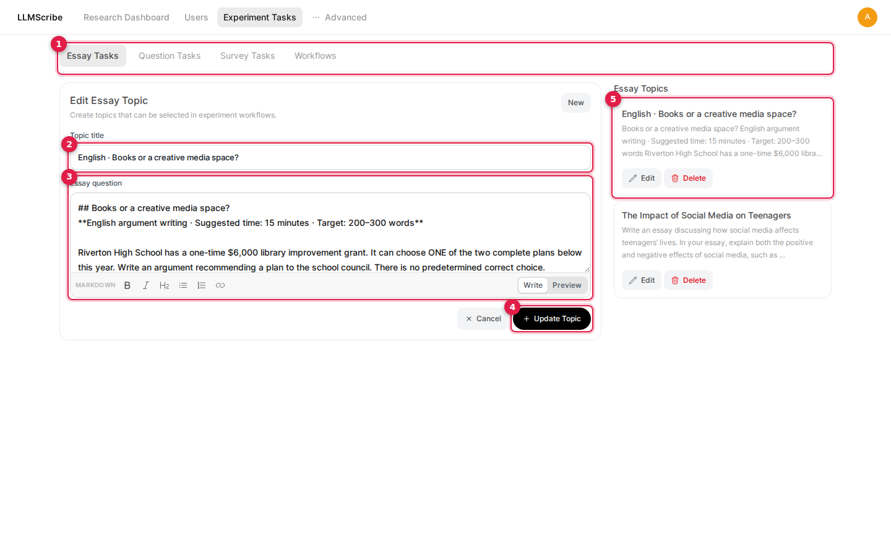

- **Task Details**: Define a descriptive title and topic summary.
- **Rich Markdown Editor & Preview**: Compose comprehensive prompts using full Markdown formatting (headings, bullet points, callouts). Toggle the **Preview** tab to verify formatting exactly as participants will experience it.
- **Word Limits & Constraints**: Specify minimum and maximum word counts and composition guidelines.
- **Task Library Roster**: Search, duplicate, edit, or delete existing essay prompts in your library.

### Question Tasks
Question tasks evaluate comprehension, knowledge retention, or problem-solving skills.

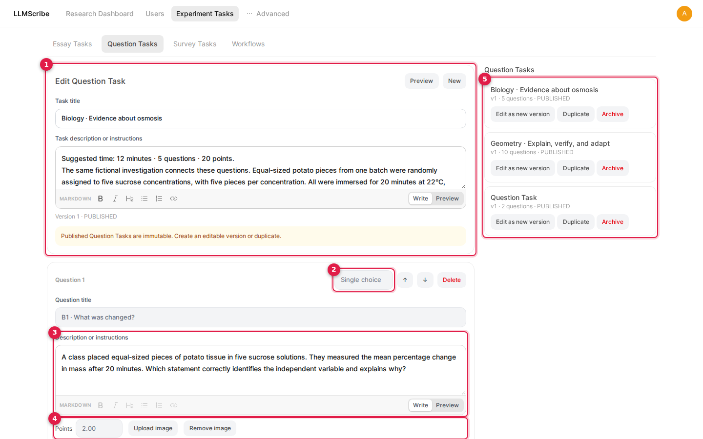

- **Flexible Question Types**: Select from Single Choice (radio), Multiple Select (checkboxes), Fill in the Blank, or Free Text / Short Answer.
- **Scoring & Rubrics**: Assign point values to each question, specify correct answer keys for automated grading, and provide rubric guidance for manual evaluation.
- **Rich Media**: Attach diagrams, charts, or images to supplement question prompts.
- **Question Bank Roster**: Organize and maintain your repository of assessment questions.

### Survey Tasks
Survey tasks collect demographic data, prior knowledge ratings, cognitive load feedback, or post-experiment reflections.

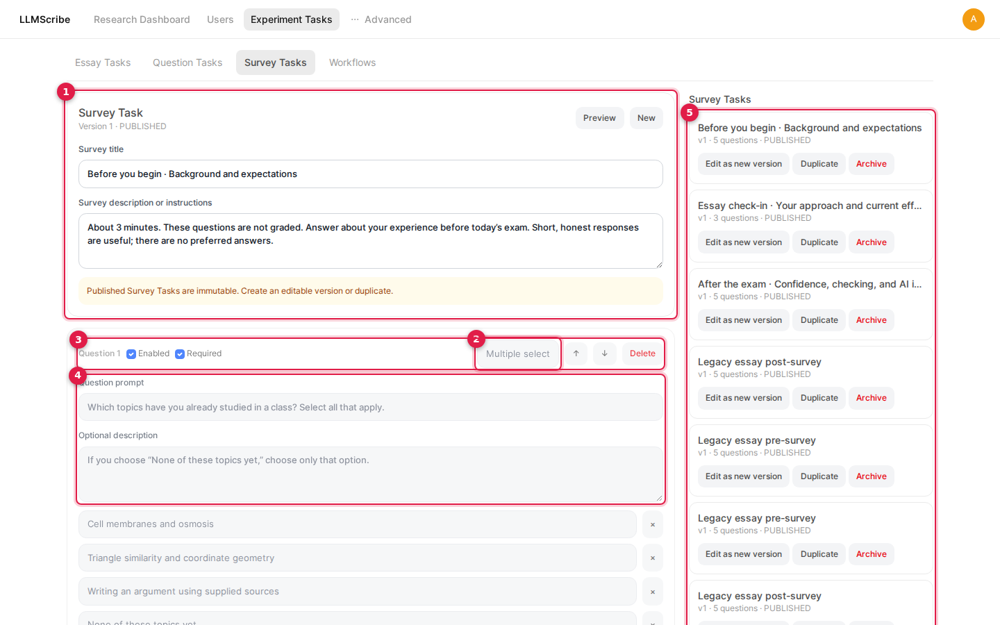

- **Item Formats**: Author 1–5 or 1–7 Likert rating scales, multiple-choice items, or open-ended reflection prompts.
- **Custom Scale Anchors**: Customize endpoint labels (e.g., "1 - Strongly Disagree" to "5 - Strongly Agree") to match standard psychometric scales.
- **Required Flags**: Mark essential questions as mandatory or allow optional responses.

---

## 5. Creating Experiment Workflows

Workflows connect modular tasks into a cohesive, sequential study pipeline with automated navigation, consent gates, and prompt allowances.

### Workflow Library
Navigate to **Experiment Tasks** &rarr; **Workflows** to access your study library.

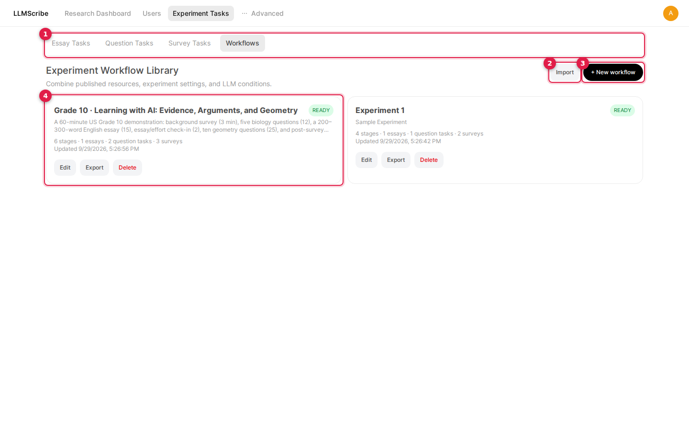

- View all existing workflows, publication versions, stage counts, and deployment statuses (`DRAFT`, `READY`).
- Click **Import** to upload a previously exported workflow bundle (`.zip`).
- Click **+ New Workflow** to author a new study pipeline.

### Workflow Editor & Navigation Progression
Click on any workflow to open the full Workflow Editor.

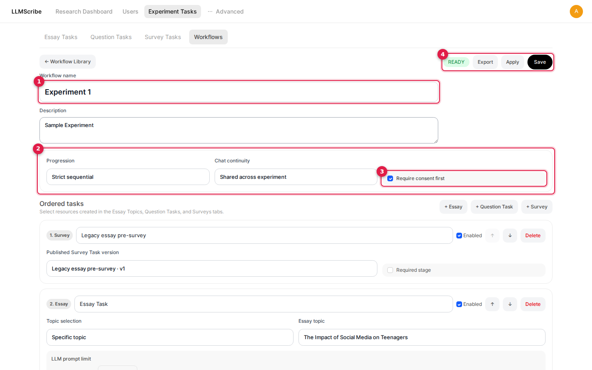

- **Metadata**: Provide a descriptive study title, internal notes, and administrative description.
- **Progression Mode**:
  - **Strict sequential**: Enforces linear progress. Participants must complete and submit each stage before the next stage unlocks, preventing skipping ahead.
  - **Free navigation**: Allows participants to switch freely between unlocked stages.
- **Consent Form & Briefing**: Enable mandatory informed consent. Participants must review and accept your consent form before entering the first study task.
- **Action Toolbar**: Save revisions, export the workflow package as a `.zip` archive, or apply the workflow to participant cohorts.

### Assembling Ordered Tasks
Scroll down to the **Ordered tasks** section to structure your study stages.

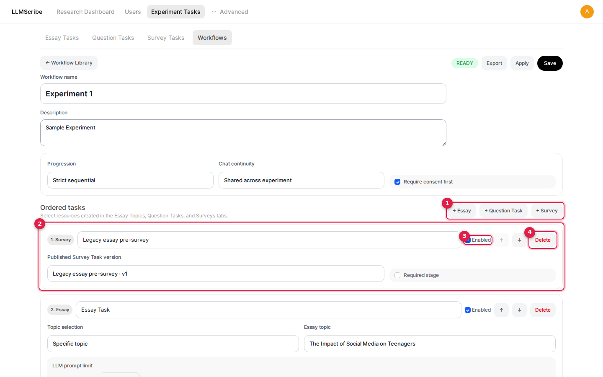

- **Add Stages**: Click **+ Essay**, **+ Question Task**, or **+ Survey** to insert pre-authored tasks into the workflow pipeline.
- **Reorder Stages**: Use the up and down arrow buttons on each stage card to reorder tasks instantly.
- **Stage Summaries**: Each card displays task metadata, stage numbers, and configured LLM prompt limits.

---

### Student LLM Prompt Limits

Controlling AI assistance access is critical for educational and cognitive research. LLMScribe provides granular, stage-level and question-level prompt budget configuration.

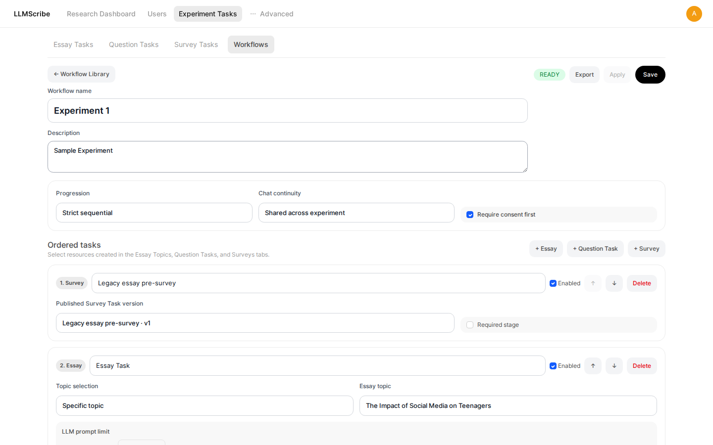

#### Budgeting Models
- **Task-Wide Limit (Essays)**:
  - Essay stages use a single shared prompt limit across the entire task (initially default to **100**).
  - Participants can distribute their prompt allowance freely across their writing and drafting process.
- **Question Task Limit Modes**:
  - **Whole task**: A single shared prompt allowance pooled across all questions in the test.
  - **Each question separately**: Dedicated, independent prompt allowances configured individually for each question item in the task.
- **Zero-Budget Behavior (`0` prompts)**:
  - Setting a limit of **0** completely disables the LLM chat interface for that specific task or question.
  - Use this setting to enforce unassisted baseline conditions (e.g., pre-tests, unaided essays, or retention quizzes) within an otherwise AI-assisted study workflow.

#### Participant Experience & Accounting Rules
- **Live Allowance Display**: Participants see prompts used, remaining allowance, and in-flight request spinners directly beside the task instructions and chat input field.
- **Success-Only Deductions**: Only successfully completed LLM responses count against the budget. Prompt regenerations and continuations count toward the limit.
- **Error & Cancellation Protection**: Network errors, server failures, or user-cancelled requests automatically restore the prompt allowance.
- **State Persistence**: Switching between tasks, questions, or browser tabs does not reset prompt consumption.
- **Limit Exhaustion**: When a participant's remaining allowance reaches 0, the chat input locks with an informative prompt-limit banner. Participants can continue reviewing existing chat histories, editing their drafts, and submitting their answers without penalty.

#### Versioning & Migration
- Existing workflows are automatically assigned a default limit of 100 upon migration.
- Workflow exports use format version 4, fully preserving both task-wide and per-question prompt allocations when imported or deployed to groups.

---

### Whole-Group Conditions & Combined Behaviors

Under **LLM behavior and response perturbations**, researchers can configure behavioral interventions across experimental conditions. Allocations are whole percentages from **0% to 100%**. Enabled conditions must total **100%** and include exactly one control condition. The control may be set to **0%** allocation if an all-intervention study is desired; conditions set to 0% or disabled conditions are never assigned to new participants.

#### Combining Reliability Warnings and Response Delays
To assign every participant in a cohort to receive both cognitive warnings and delayed responses:

1. Set the **Control** condition allocation to **0%** and leave it enabled.
2. Add a new condition named **Warning + Delay**, leave it enabled, and set its allocation to **100%**. Ensure any other conditions are set to 0% or disabled.
3. Within the condition configuration, enable the **Reliability-warning modal**. Specify the dialog text, acknowledgement prompt, and display cadence (e.g., choose **Every N prompts** with a value of **1** to trigger a warning before every prompt).
4. Set **Response timing** to **Delayed reveal** and specify the latency in seconds. The delay applies to every generated response, operating independently of the warning cadence.
5. Save the workflow and publish it to the target group.

All configured interventions within an active condition operate concurrently. Different user groups can each be assigned distinct workflows or conditions at 100%, allowing group assignment to dictate experimental conditions deterministically. Participants with active sessions maintain their original plan and condition snapshot even if a revised workflow version is published.

---

## 6. Downloading and Uploading Workflows

Workflows and their associated task libraries can be packaged, archived, and migrated across LLMScribe deployments.

- **Exporting (Downloading)**: From the Workflow Library or the Workflow Editor action toolbar, click the **Export** button. This downloads a self-contained `.zip` package containing the workflow configuration schema and all referenced essay, question, and survey task definitions.
- **Importing (Uploading)**: In the Workflow Library, click **Import** and upload a valid `.zip` bundle to instantly restore the workflow and register all constituent tasks in your local library.
- **Reference Archive**: You can download an [example workflow zip file](https://drive.google.com/file/d/1o3GPGC1hqfreddtL3Q9bhgC8dqeHnB_B/view?usp=sharing) to test import and verification capabilities.

---

## 7. Applying Workflows to User Groups

Once your workflow authoring is complete and saved in a `READY` state, apply it to a User Group to activate it for participants.

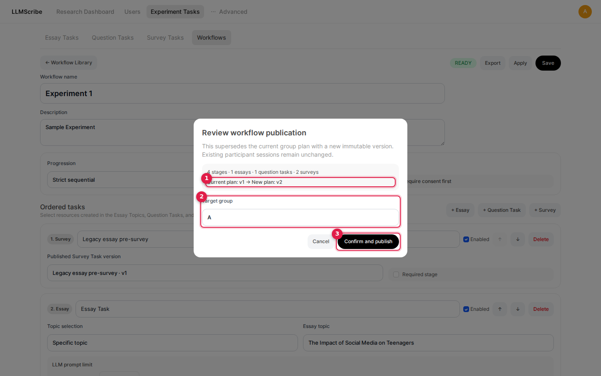

1. In the Workflow Editor header, ensure all edits are saved, then click the **Apply** button.
2. In the deployment modal, select your target **User Group** (e.g., `Cohort Alpha`) from the dropdown menu.
3. Click **Confirm and publish**.
4. The workflow is immediately deployed to that group. When enrolled participants log in, they will be directed into the newly activated study pipeline.
