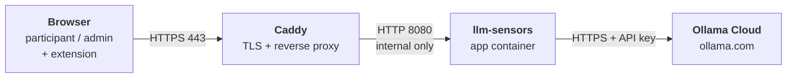

# LLM Sensors — Server Deployment Guide

As of 29 September 2026 · Image `justfarbod/llm-sensors:research` · LLM backend: Ollama Cloud

This guide deploys the research platform on any Linux server or VM with Docker, Caddy for HTTPS, and Ollama Cloud for
the models. Only creating the server, its firewall and its DNS name depend on the provider.

> **How to use this guide**
>
> - Paste every code block into the terminal exactly as shown. Paste one block at a time and wait for it to finish.
> - 🖥️ **SERVER** blocks run on the server over SSH. 💻 **YOUR COMPUTER** blocks run on your own machine.
> - Only lines ending in `# <- edit` need your own value. Change the value after `=`, then paste.
> - Blocks with a single `read` command wait for you to type or paste a value and press Enter. Always paste them on
>   their own.
> - If the terminal asks whether to paste several lines at once, confirm it.
> - Every block is safe to run again if you are unsure whether it worked.

## Contents

1. [Overview](#1-overview)
2. [Requirements](#2-requirements)
3. [Prepare the server](#3-prepare-the-server)
4. [Ollama Cloud](#4-ollama-cloud)
5. [Configuration files](#5-configuration-files)
6. [Start and first-run setup](#6-start-and-first-run-setup)
7. [Browser telemetry extension](#7-browser-telemetry-extension)

---

## 1. Overview

The platform runs as two Docker containers on any Linux server. Models come from Ollama Cloud over HTTPS, so the server
needs no GPU and runs no local model.



*The app stores all data in the Docker volume `llm-sensors-data`.*

Caddy is the only container reachable from the internet. It gets and renews a Let's Encrypt certificate on its own. The
app container stores everything (SQLite database, uploads, experiment data) in the `llm-sensors-data` volume. That
volume is the one thing you must back up.

| Component     | Image                             | Role                                         |
| ------------- | --------------------------------- | -------------------------------------------- |
| App           | `justfarbod/llm-sensors:research` | Web UI, API, experiments, telemetry          |
| Reverse proxy | `caddy:2`                         | HTTPS termination, certificates, websockets  |
| LLM           | Ollama Cloud (external)           | Model inference via API key                  |

---

## 2. Requirements

A 2 vCPU / 4 GB Linux server with a public IP, a DNS name and an Ollama account is enough. Inference happens at Ollama
Cloud, so server size only depends on the app itself and the number of participants.

| Item              | Minimum                               | Recommended                   | Notes                                                                                    |
| ----------------- | ------------------------------------- | ----------------------------- | ---------------------------------------------------------------------------------------- |
| App image         | Built from commit `e5ed578f2` or later | Latest                        | Older images lack the extension name check and the **Download extension** button used in section 7 |
| OS                | 64-bit Linux                          | Ubuntu Server 24.04 LTS       | The commands in this guide assume Ubuntu or Debian                                       |
| CPU architecture  | Must match the image                  | x86-64 (amd64)                | Images built on an x86 PC without `buildx --platform` are amd64 only                     |
| vCPU              | 2                                     | 2–4                           |                                                                                          |
| RAM               | 4 GB                                  | 4–8 GB                        | The app uses about 1–2 GB at rest                                                        |
| Disk              | 30 GB                                 | 64 GB SSD                     | The image is several GB; data grows with sessions and backups                            |
| Public IPv4       | Static                                | Static                        | DNS and certificates break if it changes                                                 |
| DNS name          | Any A record                          | e.g. `research.example.edu`   | Needed for HTTPS; the extension is set to this exact hostname                            |
| Inbound ports     | 22, 80, 443                           | Same                          | 80 is required for Let's Encrypt; do not open 8080                                       |
| Outbound          | HTTPS to the internet                 | Same                          | Docker Hub, Let's Encrypt, `ollama.com`                                                  |
| Software          | Docker Engine + compose plugin        | Same                          | Installed in section 3                                                                   |
| LLM               | Ollama account + API key              | Same                          | See section 4                                                                            |

> [!WARNING]
> Ollama Cloud's free plan allows **1 concurrent request** and a limited set of starter models
> ([ollama.com/pricing](https://ollama.com/pricing)). This is fine for testing. For a study session with several
> participants at once, requests queue or fail. Pro ($20/month) allows 3 and Max ($100/month) allows 10.

Ollama states that prompts and responses are not logged or trained on. Confirm that sending participant chats to an
external service is covered by your consent and data-handling approval.

---

## 3. Prepare the server

Install Docker, confirm the architecture, save your domain, and lock the firewall down to SSH and web traffic. Connect to
the server over SSH as your normal sudo user.

### 3.1 Update the system

🖥️ **SERVER**

```bash
sudo apt update && sudo DEBIAN_FRONTEND=noninteractive apt -y upgrade
```

### 3.2 Check the architecture

🖥️ **SERVER** — It must print `x86_64` for an amd64 image.

```bash
uname -m
```

### 3.3 Install Docker

🖥️ **SERVER** — Installs Docker Engine and the compose plugin with Docker's official script, then lets your user run
Docker without `sudo`.

```bash
curl -fsSL https://get.docker.com | sh
sudo usermod -aG docker $USER
```

Log out with `exit` and connect with SSH again, so the group change applies. Then check that both commands print a
version:

```bash
docker version && docker compose version
```

### 3.4 Enable the firewall

🖥️ **SERVER** — Skip this if your provider already has a network firewall that only allows 22, 80 and 443 (e.g. an
Azure network security group).

```bash
sudo ufw allow OpenSSH
sudo ufw allow 80,443/tcp
sudo ufw --force enable
```

### 3.5 Save your domain

🖥️ **SERVER** — Point your DNS name at the server's public IP first. This block saves the name in the deployment
folder, where every later step reads it, and prints two IP addresses: the one your name points to and the server's own.
They must be the same.

```bash
mkdir -p ~/llm-sensors && cd ~/llm-sensors && touch .env && sed -i '/^DOMAIN=/d' .env
echo "DOMAIN=research.example.edu" >> .env   # <- edit (hostname only, no https://)
. ./.env && getent hosts "$DOMAIN"; curl -s https://ifconfig.me; echo
```

### 3.6 Turn on automatic security updates

🖥️ **SERVER** — Optional but recommended.

```bash
sudo DEBIAN_FRONTEND=noninteractive apt -y install unattended-upgrades
echo "unattended-upgrades unattended-upgrades/enable_auto_updates boolean true" \
  | sudo debconf-set-selections
sudo dpkg-reconfigure -f noninteractive unattended-upgrades
```

---

## 4. Ollama Cloud

The app talks to `https://ollama.com` directly, authenticating with an API key. No Ollama install is needed on the
server ([docs.ollama.com/cloud](https://docs.ollama.com/cloud)).

1. Create an account at [ollama.com](https://ollama.com) and sign in.
2. Create an API key at [ollama.com/settings/keys](https://ollama.com/settings/keys) and copy it somewhere safe. It is
   shown only once. Don't confuse it with `WEBUI_SECRET_KEY` (step 5.1), which also looks like a long random string.

### 4.1 Test the key

🖥️ **SERVER** — Paste this line alone. It waits for you to paste the key and press Enter. The key is not shown on
screen and not saved in your shell history.

```bash
read -s -p "Ollama API key: " OLLAMA_API_KEY; echo
```

🖥️ **SERVER** — Then send a test prompt. `gpt-oss:20b` is an example; use a model your plan includes.

```bash
curl -s -w "\nHTTP %{http_code}\n" https://ollama.com/api/chat \
  -H "Authorization: Bearer $OLLAMA_API_KEY" \
  -H "Content-Type: application/json" \
  -d '{"model":"gpt-oss:20b","messages":[{"role":"user","content":"Hi"}],"stream":false}'
```

`HTTP 200` with a `message.content` field means the key and model work. `HTTP 401` means the key is wrong. An error
about plan or credits means you need a model included in your plan.

Model names differ by client. Calling `ollama.com` directly (as the app does) uses names like `gpt-oss:20b`. The Ollama
desktop app and CLI use a `-cloud` suffix such as `gpt-oss:20b-cloud`.

Monitor usage at [ollama.com/settings/usage](https://ollama.com/settings/usage). The free plan's credits run out quickly
with many participants.

---

## 5. Configuration files

Three files in `~/llm-sensors` define the whole deployment: `.env` for settings and secrets, `docker-compose.yml` for
the containers, and `Caddyfile` for HTTPS. Each block below creates one file; nothing needs editing.

### 5.1 .env

🖥️ **SERVER** — Writes the settings next to the domain from step 3.5 and generates a random `WEBUI_SECRET_KEY`.
Running it again keeps the existing domain, secret and extension settings.

```bash
cd ~/llm-sensors && . ./.env
SECRET=$(grep -s '^WEBUI_SECRET_KEY=' .env | cut -d= -f2)
[ -n "$SECRET" ] || SECRET=$(openssl rand -hex 32)
EXT=$(grep '^EXPERIMENT_TELEMETRY_EXTENSION_' .env ||
  echo EXPERIMENT_TELEMETRY_EXTENSION_ENABLED=false)
cat > .env <<EOF
DOMAIN=$DOMAIN
WEBUI_SECRET_KEY=$SECRET
OLLAMA_BASE_URL=https://ollama.com
ENABLE_OPENAI_API=false
ENABLE_SIGNUP=false
ENABLE_INITIAL_ADMIN_SIGNUP=true
$EXT
EOF
chmod 600 .env
grep -v SECRET .env
```

- `WEBUI_SECRET_KEY` signs login sessions. It must stay the same across redeploys. It is **not** the Ollama key.
- `ENABLE_OPENAI_API=false` hides the unused OpenAI connection, which would otherwise show errors.
- `ENABLE_SIGNUP=false` with `ENABLE_INITIAL_ADMIN_SIGNUP=true` lets exactly one person register, the admin.
  Participants are then created by the admin with bulk user generation.
- Settings such as `ENABLE_SIGNUP` and `OLLAMA_BASE_URL` are copied into the database on first start. Afterwards,
  change them in Admin Settings, because editing `.env` has no effect on them.

### 5.2 docker-compose.yml

🖥️ **SERVER** — The file is written in JSON form, which Docker Compose reads like YAML. Unlike YAML, it doesn't depend
on indentation, so it still works if copying drops leading spaces.

```bash
cd ~/llm-sensors
cat > docker-compose.yml <<'EOF'
{
  "services": {
    "llm-sensors": {
      "image": "justfarbod/llm-sensors:research",
      "container_name": "llm-sensors",
      "restart": "unless-stopped",
      "env_file": ".env",
      "environment": {
        "WEBUI_URL": "https://${DOMAIN}",
        "CORS_ALLOW_ORIGIN": "https://${DOMAIN}"
      },
      "volumes": ["llm-sensors-data:/app/backend/data"],
      "logging": {"driver": "json-file", "options": {"max-size": "20m", "max-file": "5"}}
    },
    "caddy": {
      "image": "caddy:2",
      "container_name": "caddy",
      "restart": "unless-stopped",
      "ports": ["80:80", "443:443"],
      "environment": {"DOMAIN": "${DOMAIN}"},
      "volumes": [
        "./Caddyfile:/etc/caddy/Caddyfile:ro",
        "caddy-data:/data",
        "caddy-config:/config"
      ],
      "depends_on": ["llm-sensors"]
    }
  },
  "volumes": {"llm-sensors-data": {}, "caddy-data": {}, "caddy-config": {}}
}
EOF
docker compose config --quiet && echo "docker-compose.yml is valid"
```

The app container publishes no ports, so it is only reachable through Caddy. This matters because Docker-published
ports bypass `ufw`. The `research` tag pins the image you built.

### 5.3 Caddyfile

🖥️ **SERVER** — Caddy obtains the certificate for `DOMAIN` automatically and proxies websockets, which chat streaming
needs, without extra settings.

```bash
cd ~/llm-sensors
cat > Caddyfile <<'EOF'
{$DOMAIN} {
    encode zstd gzip
    reverse_proxy llm-sensors:8080
}
EOF
```

---

## 6. Start and first-run setup

Pull and start the stack, register the admin account before anyone else can, then add the Ollama Cloud key. The whole
process takes about 10 minutes.

### 6.1 Start the containers

🖥️ **SERVER** — The last line prints your site's address.

```bash
cd ~/llm-sensors
docker compose pull
docker compose up -d
. ./.env && echo "Open https://$DOMAIN in 2-3 minutes"
```

The first start runs database migrations and requests the HTTPS certificate, which takes a few minutes. Until then the
browser may show an error; reload after a minute.

### 6.2 Set up the platform in the browser

1. Open the printed address and **register the admin account immediately**. The first account becomes admin. With this
   `.env`, sign-up closes after it.
2. Add the Ollama Cloud key: open **Admin Settings → Connections**, and under **Ollama API** click the settings icon
   next to `https://ollama.com`.
   - Set **Auth** to **Bearer** and paste the Ollama key into **API Key**.
   - Optional: under **Model IDs**, list only the models participants may use (e.g. `gpt-oss:20b`). Otherwise every
     cloud model appears in the model menu.
   - Click **Verify Connection**, then **Save** in the dialog and **Save** again on the Connections page.
3. Open a new chat, pick the model from the menu at the top and send a message. A streamed reply confirms the whole path
   (browser, Caddy, websockets, app, Ollama Cloud).
4. Confirm sign-ups are off: **Admin Settings → General → Enable New Sign Ups** should be off.
5. Create participants: **Users** → bulk user generation, then export the generated credentials. Put them into groups
   under **Users → Groups**.
6. Set up the study: import or build a workflow under **Experiment Tasks** and apply it to a group. See
   [ADMIN_PANEL_GUIDE.md](ADMIN_PANEL_GUIDE.md) sections 4–7.

---

## 7. Browser telemetry extension

Participants receive the extension as a zip file from a download link and load it into Chrome themselves. You start from
the ready-made base zip, set your server's hostname in it, and zip it again. No build or repository is needed. The
server recognizes the extension by its name, so there is no ID to copy. Skip this section if the study does not use the
extension; `.env` already keeps it disabled.

> [!WARNING]
> The extension records tab URLs and titles, keystrokes, and copied, cut and pasted text in tracked fields. Consent
> materials must say so (see
> [browser-extension/experiment-telemetry/README.md](../browser-extension/experiment-telemetry/README.md)).

The base zip is at
[drive.google.com/file/d/1RxEBmyuhs0WZdvRaFn0r4bAQiDIlQUYy](https://drive.google.com/file/d/1RxEBmyuhs0WZdvRaFn0r4bAQiDIlQUYy).
It contains version 2.2.0, set to `llm-sensors.belgiumcentral.cloudapp.azure.com`. If that is your server's hostname,
skip step 7.1 and use the base zip as it is.

### 7.1 Set your hostname in the zip

Use either the command (option A) or edit the file by hand (option B). Both produce `llm-sensors-extension.zip` for your
server.

#### Option A: one command

💻 **YOUR COMPUTER** — Run in a bash terminal (Linux, macOS or WSL; needs `curl` and `python3`). Downloads the base zip,
sets the hostname and writes the new zip to `~/llm-sensors-extension`.

```bash
DOMAIN=research.example.edu   # <- edit (same hostname as on the server)
mkdir -p ~/llm-sensors-extension && cd ~/llm-sensors-extension
curl -fsSL -o base.zip \
  "https://drive.google.com/uc?export=download&id=1RxEBmyuhs0WZdvRaFn0r4bAQiDIlQUYy"
python3 - "$DOMAIN" <<'EOF'
import json, sys, zipfile
origin = "https://" + sys.argv[1].replace("https://", "").strip("/")
src = zipfile.ZipFile("base.zip")
files = {name: src.read(name) for name in src.namelist()}
manifest = json.loads(files["manifest.json"])
manifest["host_permissions"] = [origin + "/*"]
for script in manifest["content_scripts"]: script["matches"] = [origin + "/*"]
manifest["action"]["default_title"] = "Connect to your experiment at " + origin
files["manifest.json"] = json.dumps(manifest, indent=2)
out = zipfile.ZipFile("llm-sensors-extension.zip", "w", zipfile.ZIP_DEFLATED)
[out.writestr(name, data) for name, data in files.items()]
out.close()
print("Created ~/llm-sensors-extension/llm-sensors-extension.zip for " + origin)
EOF
```

💻 **YOUR COMPUTER** — Optional, on WSL only: opens the folder in Windows so you can find the zip.

```bash
explorer.exe "$(wslpath -w ~/llm-sensors-extension)"
```

#### Option B: by hand

1. Download the base zip from the link above and unzip it into a new folder.
2. Open `manifest.json` from that folder in a text editor (e.g. Notepad or TextEdit).
3. Use **Find and Replace** to replace `llm-sensors.belgiumcentral.cloudapp.azure.com` with your hostname. It appears
   **3 times**: under `host_permissions`, under `matches`, and in `default_title`. Keep the `https://` in front and the
   `/*` after it. Save the file.
4. Open the folder, select **all the files inside it** (not the folder itself) and compress them into a zip: on Windows,
   right-click → **Compress to ZIP file** (or **Send to → Compressed (zipped) folder**); on macOS, right-click →
   **Compress**. Rename the result to `llm-sensors-extension.zip`.

To move to another hostname later, repeat step 7.1 with the new name.

### 7.2 Upload the zip

Upload `llm-sensors-extension.zip` to any file host that gives participants an HTTPS link, e.g. Google Drive with
sharing set to **Anyone with the link**, or your university cloud storage. This is the zip participants download; they
don't change anything in it.

### 7.3 Enable the extension on the server

🖥️ **SERVER** — Paste this line on its own, then paste the download link from step 7.2 and press Enter:

```bash
read -p "Download link (https://...): " EXT_URL
```

🖥️ **SERVER** — Then write the extension settings and apply them. Data stays in the volume.

```bash
cd ~/llm-sensors && . ./.env
sed -i '/^EXPERIMENT_TELEMETRY_EXTENSION_/d' .env
cat >> .env <<EOF
EXPERIMENT_TELEMETRY_EXTENSION_ENABLED=true
EXPERIMENT_TELEMETRY_EXTENSION_ORIGIN=https://$DOMAIN
EXPERIMENT_TELEMETRY_EXTENSION_NAME="Open WebUI Experiment Telemetry"
EXPERIMENT_TELEMETRY_EXTENSION_STORE_URL="$EXT_URL"
EXPERIMENT_TELEMETRY_EXTENSION_MIN_VERSION=2.2.0
EOF
docker compose up -d
```

The experiment Start screen now shows a **Download extension** button that opens your download link. If you later
change the download link or hostname, repeat this step with the new values.

### 7.4 Installation steps for participants

Send participants these steps, and follow them once yourself in a participant account before the study.

1. On the experiment Start screen, click **Download extension** and download the zip. On a Google Drive page, use its
   **Download** button.
2. Unzip the file into a folder you keep, e.g. in Documents. Chrome loads the extension from this folder, so don't
   delete or move it during the study.
3. In Chrome, open `chrome://extensions`, turn on **Developer mode** (top right), click **Load unpacked** and select the
   unzipped folder (the one containing `manifest.json`).
4. Return to the experiment tab and wait for **Extension connected**. There is no need to click the extension icon.
